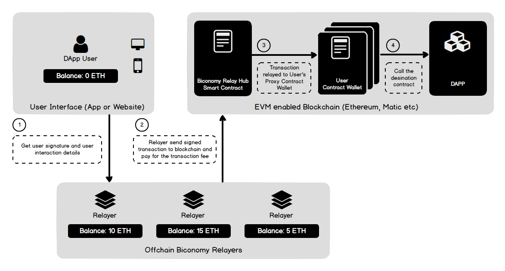

Biconomy uses a proxy contract approach to enable meta-transactions on your DApp. The two major implications it has on you as a developer are:

- Any transactions made by the user will have `from` parameter set as the user's proxy contract instead of user's account
- Biconomy runs the relayers and pays Gas fee upfront which is recovered from the DApp on monthly basis
- The smart contract accepting signed transactions will require no changes in the smart contract code whatsoever



from [https://docs.biconomy.io/](https://docs.biconomy.io/)

The following tutorial builds upon a previous tutorial [link], where we built an Airbnb smart contract, followed by [link], where we deployed the complete DApp.

Biconomy offers their SDK that makes this integration seamless, called Mexa.

Integration with Mexa is a two step process:

1. Register your DApp on Mexa Dashboard, a dashboard for developers, and copy DApp ID and API Key generated for your DApp.
2. Integrate Mexa SDK in your DApp code using DApp ID and API Key you got from dashboard.

## Setting up your DApp

You'll first need your deployed smart contract and it's ABI to register on the dashboard.

clone the repository and checkout on `complete-dapp` branch
```js
$ git clone https://github.com/maticnetwork/ethindia-workshop && cd ethindia-workshop
$ git checkout complete-dapp
```
Edit your `./truffle-config.js` to add `matic` network details. The file should look something like this:
```js
const HDWalletProvider = require('truffle-hdwallet-provider');
const fs = require('fs');
const mnemonic = fs.readFileSync(".secret").toString().trim();

module.exports = {
  networks: {
    development: {
      host: "127.0.0.1",     // Localhost (default: none)
      port: 8545,            // Standard Ethereum port (default: none)
      network_id: "*",       // Any network (default: none)
    },
    matic: {
      provider: () => new HDWalletProvider(mnemonic, `https://testnetv3.matic.network`),
      network_id: 15001,
      gasPrice: '0x0',
      confirmations: 2,
      timeoutBlocks: 200,
      skipDryRun: true
    },
  },
  ......
  ......
}
```

Next, compile your smart contract and deploy on matic network
```js
$ truffle compile
$ truffle migrate --network matic
```
## Registering on Biconomy dashboard

Follow the steps **[here](https://docs.biconomy.io/biconomy-dashboard)**, to register an account and add a DApp to get the keys, and configure functions that will accept signed transactions.

For now, we'll set `rentOutProperty` function to accept meta transactions


## Integrate Mexa SDK in your DApp client code

`cd` into `dapp-ui` to configure your client code to relay transactions
```js
cd dapp-ui
npm install @biconomy/mexa
```
Now, Update utils.js, Import & initialize mexa and web3
```js
import Biconomy from "@biconomy/mexa";

const biconomy = new Biconomy('wss://testnetv3-wss.matic.network/',
  { dappId: '5e1428bd306ea71e14616039', 
    apiKey: 'wDjRYJmUl.d9215668-1a63-4f7f-ab34-6f654bc47fea' }
);

web3 = new Web3(biconomy);
```