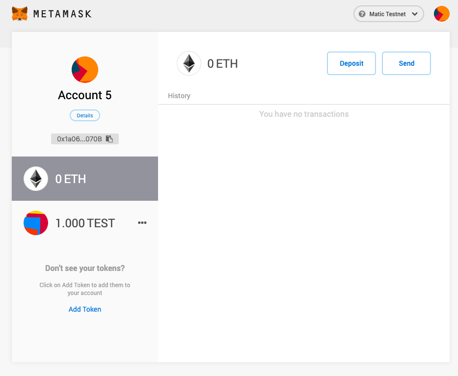
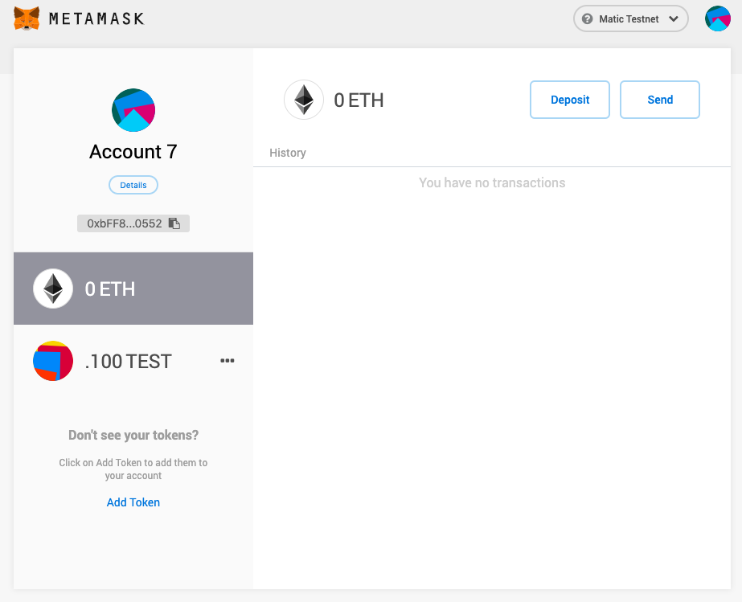
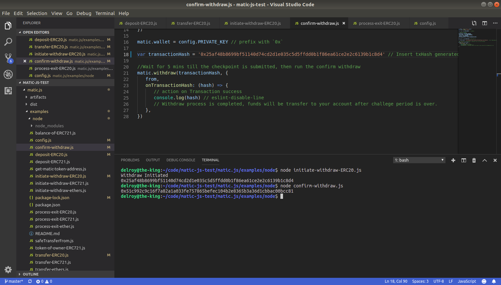
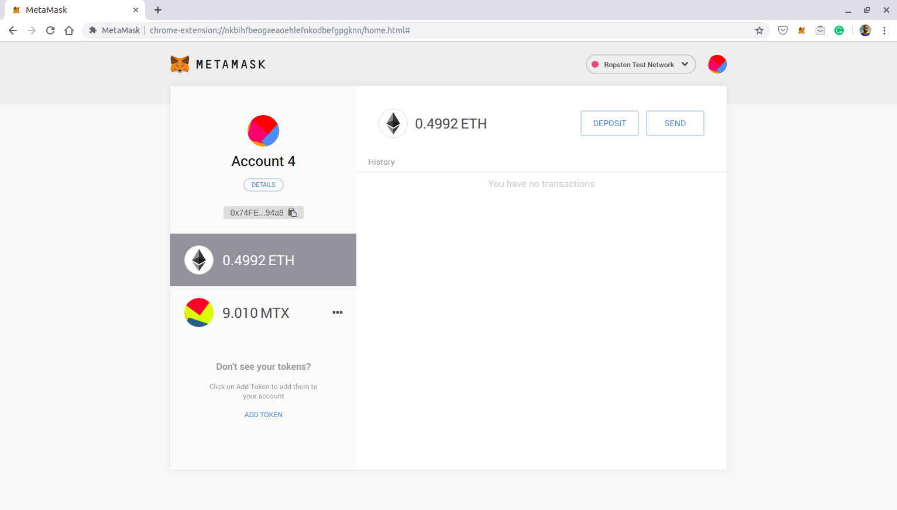

# Beginner-friendly tutorial to Matic.js

This tutorial will act as a guide for a step-by-step process to understand and use [Matic JS](http://github.com/maticnetwork/matic.js), which is the easiest way to interact with the Matic Network. This guide is directed towards developers starting to begin their Ethereum journey. If you want to dive right ahead, feel free to skim through the article or choose to directly go to https://docs.matic.network/getting-started/.

### Prerequisites:

### Some ETH on Ropsten in your account

In order to make any transactions, you will also need some Ether in the test accounts that you will use while following the tutorial. In case you don’t have some ETH on Ropsten, you can use the faucet links given here — https://faucet.metamask.io/ or https://faucet.ropsten.be/.

### Matic Faucet

Throughout this tutorial, we will be using the ERC20 token `MTX` on the Ropsten network as an example. This is a TEST token. In your DApp,you can replace it with any ERC20 token. To get some Test `MTX` tokens on Matic Network, you can access the Matic Faucet: https://wallet.matic.network/faucet

All you would need to do is follow simple steps on the link above and you will get some funds in to your account:

1. Go to the link and enter your address
2. Copy the tweet content and tweet it
3. Now, paste the Tweet Id in the last field and click on `Get Test Matic'`

## Using Matic JS

We will be showcasing the flow for asset transfers on the Matic Network in this tutorial and how you can do the same using Matic.js:


- User deposits tokens in Matic contract on mainchain
- Once deposited tokens get confirmed on the main chain, the corresponding tokens will get reflected on the Matic chain.
- The user can now transfer tokens to anyone they want instantly with negligible fees. Matic chain has faster blocks (approximately 1 second). That way, the transfer will be done almost instantly.
- Once a user is ready, they can withdraw remaining tokens from the mainchain by establishing proof of remaining tokens on Root contract (contract deployed on Ropsten/Ethereum chain) within 7 days.
- User can also get a fast exit via 0x or Dharma (coming soon!)

### Basic setup for the tutorial

To easily visualise the flow of funds on the Matic Network, it is instructive if you configure the Matic testnet on Metamask. Note that we are using Metamask here solely for visualization purposes. There is no requirement to use Metamask at all for using the Matic Network.

Before starting with the tutorial, go ahead and have 3 Ethereum test accounts ready. In case you are new to Ethereum and Metamask, you can refer https://docs.matic.network/newbies/create-accounts-metamask/ on instructions on how to.

For your reference we will be using the following accounts in this tutorial

```js
Account #1: 0xdcd53258BA8A69C6a505300BE75447A772bFd3d6
Account #2: 0xbAf7D06543b241E286dc776545c8e9F318aBcC47
Account #3: 0x4933ba598e6B1f33bCDc299bE76AbE2DdFbCC6A4
```

When you create multiple accounts at your end, your addresses will be different from those shown here.

In order to view the flow of funds easily on the Matic Network using Matic.js, you can configure Matic’s testnet URL on Metamask. Refer this link — https://docs.matic.network/newbies/conf-testnet-metamask/ to quickly set it up. Note this is **optional**. You can query using web3, if you choose to.

### Configuring Matic Test tokens on Metamask

The `MTX` token, taken as an example for this tutorial, can be configured in Metamask so as to easily visualise account balances. Again note this is **optional**. You can very easily query the token balances and other variables using [web3](https://web3js.readthedocs.io/en/1.0/)

These Test tokens needs to be added to all 3 test accounts in Metamask once each in both the Ropsten and Matic testnets:


```js
Token name: MTX
Where: Ropsten Network
Contract address: 0x6b0b0e265321e788af11b6f1235012ae7b5a6808

----------------------

Token name: MTX (Note: When adding the Matic Testnet token in Metamask, make sure you edit the ticker symbol from CHE to MTX)
Where: Matic Testnet (Custom RPC: https://testnet2.matic.network)
Contract address: 0xcc5de81d1af53dcb5d707b6b33a50f4ee46d983e
```

In case you are new to Ethereum and Metamask, you can refer https://docs.matic.network/newbies/conf-custom-tokens-metamask/ on instructions on how to.

## Introducing Matic.js

The Matic.js repository is hosted on Github at https://github.com/maticnetwork/matic.js/

For reference purposes, I will be creating a test folder to showcase how to setup Matic.js step-by-step. Go ahead and create a folder for this tutorial — I am going with `$ mkdir matic-js-test`

Install the `maticjs` package via npm:

`$ npm install --save web3 maticjs`

If you wish to directly refer a set of code examples, you can do so at https://github.com/maticnetwork/matic.js/tree/master/examples

### Depositing Funds from Ropsten to Matic

Within the `matic-js-test` folder, create a new file and name it `deposit-ERC20.js`.

```js
const Matic = require('maticjs').default
const config = require('./config')

const token = config.ROPSTEN_TEST_TOKEN // test token address
const amount = '1000000000000000000' // amount in wei
const from = config.FROM_ADDRESS // from address

// Create object of Matic
const matic = new Matic({
  maticProvider: config.MATIC_PROVIDER,
  parentProvider: config.PARENT_PROVIDER,
  rootChainAddress: config.ROOTCHAIN_ADDRESS,
  syncerUrl: config.SYNCER_URL,
  watcherUrl: config.WATCHER_URL,
})

matic.wallet = config.PRIVATE_KEY // prefix with `0x`

// Approve token
matic
  .approveERC20TokensForDeposit(token, amount, {
    from,
    onTransactionHash: (hash) => {
      // action on Transaction success
      console.log(hash) // eslint-disable-line
    },
  })
  .then(() => {
    // Deposit tokens
    matic.depositERC20Tokens(token, from, amount, {
      from,
      onTransactionHash: (hash) => {
        // action on Transaction success
        console.log(hash) // eslint-disable-line
      },
    })
  })
```

Let’s understand this a bit in detail.

`token` is the address of the `MTX` TEST ERC20 token contract taken as an example in this tutorial. You will replace it with the relevant ERC20 token address in your DApp.

```js
const token = "config.ROPSTEN_TEST_TOKEN" // test token address
```

`amount` is the amount that is to be deposited. Amount is mentioned in `wei` . To those new to the field, `1 MTX` token is equivalent to 10¹⁸ `wei` . In the code snippet, `0.01 MTX` = 10¹⁶ `wei`.

```js
const amount = "10000000000000000" // amount in wei (0.01 TEST)
```

`from` is your address. This will be address from which funds will be debited. Note that this is my test account address — you will need to plug your own address in here.

```js
const from = "0xdcd53258BA8A69C6a505300BE75447A772bFd3d6" // from address
```

`matic.wallet` is your private key. **Never store your private key in code on production** — this is added in the `config.js` file for illustration purposes. Typically a user’s private key will be stored in a browser wallet such as Metamask or a mobile wallet such as the Matic wallet, Status or a hardware wallet.

```js
matic.wallet = config.PRIVATE_KEY // prefix with `0x`
```

You will also need to create another file `config.js`. This will contain all configuration related to Matic.js.

```js
module.exports = {
  MATIC_PROVIDER: 'https://testnet2.matic.network',
  PARENT_PROVIDER:
    'https://ropsten.infura.io/v3/70645f042c3a409599c60f96f6dd9fbc',
  ROOTCHAIN_ADDRESS: '0x60e2b19b9a87a3f37827f2c8c8306be718a5f9b4',
  WITHDRAWMANAGER_ADDRESS: '0x4ef2b60cdd4611fa0bc815792acc14de4c158d22',
  DEPOSITMANAGER_ADDRESS: '0x4072fab2a132bf98207cbfcd2c341adb904a67e9',
  SYNCER_URL: 'https://matic-syncer2.api.matic.network/api/v1',
  WATCHER_URL: 'https://ropsten-watcher2.api.matic.network/api/v1',
  ROOTWETH_ADDRESS: '0x421dc9053cb4b51a7ec07b60c2bbb3ec3cfe050b',
  MATICWETH_ADDRESS: '0x31074c34a757a4b9FC45169C58068F43B717b2D0',
  PRIVATE_KEY: 'Paste your private key here ...', // prefix with `0x`
  FROM_ADDRESS: 'Paste address belongs to Private key here ...',
  ROPSTEN_TEST_TOKEN: '0x6b0b0e265321e788af11b6f1235012ae7b5a6808',
  MATIC_TEST_TOKEN: '0xcc5de81d1af53dcb5d707b6b33a50f4ee46d983e',
  ROPSTEN_ERC721_TOKEN: '0x07d799252cf13c01f602779b4dce24f4e5b08bbd',
  MATIC_ERC721_TOKEN: '0x9f289a264b6db56d69ad53f363d06326b984e637',
}
```

For now, don’t worry about these values — just keep them as is.

You will need to add your private key here. Signing of transactions will require your private key. Again, it is **NOT ADVISABLE** to hard code your private key when on production. Later, you can build keeping in mind that the user will be handling their keys at their end with MetaMask, Matic Wallet or any other compatible user wallet.

```js
PRIVATE_KEY: "<insert-your-private-key-here>"
```

Deposit is a 2 step process

- The tokens need to be first approved to the Matic rootchain contract on Ethereum.

```js
// Approve token
matic
  .approveERC20TokensForDeposit(token, amount, {
    from,
    onTransactionHash: (hash) => {
      // action on Transaction success
      console.log(hash, 'Deposit Tokens from Ropsten/Ethereum to Matic — Transaction Approved.') // eslint-disable-line
    },
  })
```

- Once approved, the deposit function is to be invoked where the tokens get deposited to the Matic contract, and are available for use in the Matic network.

```js
 // Deposit tokens
    matic.depositERC20Tokens(token, from, amount, {
      from,
      onTransactionHash: (hash) => {
        // action on Transaction success
        console.log(hash, 'Tokens deposited from Ropsten/Ethereum to Matic.') // eslint-disable-line
      },
    })
```

For reference purposes, the screenshots below will provide context during the actual deposit.

We currently have `9988.460 MTX` tokens and `19` ETH at our address `(0xdcd53258BA8A69C6a505300BE75447A772bFd3d6)` on Ropsten Network,


while on Matic Network we have `0 Matic ETH` and `4.680 MTX` tokens.


We will be depositing `0.100 MTX` tokens to Matic Testnet.

Let’s run the Deposit function. To run use:

`$ node deposit-ERC20.js`

We have added console logging for both events, which when run successfully will display the Transaction Hash as well as a message `“Deposit Tokens from Ropsten/Ethereum to Matic — Transaction Approved.”.` Once deposit is complete, you will see the Transaction Hash and message `”Tokens deposited from Ropsten/Ethereum to Matic.”` Since this is only for illustration purposes, the message can be customized to anything of your choice. By default it will only display the Transaction Hash.


Let’s verify our account balances on Metamask.

Our Balance on Ropsten now shows `9988.360 MTX` which means our Deposit transaction of `0.100 MTX` was successful.


Verifying our balance on Matic Testnet also shows that our balance is increased by `0.100 MTX`.



Congratulations! You have successfully deposited funds from Ropsten to Matic.

In order to ensure you have more funds, deposit `1 MTX` token to Matic by repeating the above process. Make sure you change the `amount` value in the above script.

### Transferring funds from Matic

Once you have funds on Matic, you can use those funds to send to others instantly.

Create a new file — `transfer-ERC20.js` —  in your code directory.

```js
const Matic = require('maticjs').default
const config = require('./config')

const from = config.FROM_ADDRESS // from address
const recipient = 'Paste Your receipent address here ...' // receipent address

const token = config.MATIC_TEST_TOKEN // test token address
const amount = '100000000000000000' // amount in wei

// Create object of Matic
const matic = new Matic({
  maticProvider: config.MATIC_PROVIDER,
  parentProvider: config.PARENT_PROVIDER,
  rootChainAddress: config.ROOTCHAIN_ADDRESS,
  syncerUrl: config.SYNCER_URL,
  watcherUrl: config.WATCHER_URL,
})

matic.wallet = config.PRIVATE_KEY // prefix with `0x`

// Send Tokens
matic.transferTokens(token, recipient, amount, {
  from,
  // parent: true, // For token transfer on Main network (false for Matic Network)
  onTransactionHash: (hash) => {
    // action on Transaction success
    console.log(hash) // eslint-disable-line
  },
})

```

`recipient` is the receiver’s address, to whom the funds are supposed to be sent.

```js
const recipient = "0x4933ba598e6B1f33bCDc299bE76AbE2DdFbCC6A4" // to address
```

`token` is the Matic TEST token contract address on the Matic testnet. **Note that this is different from the Ropsten MTX token contract address.**. This is automatically picked up from the `config.js` file.

```js
const token = config.MATIC_TEST_TOKEN // test token address
```

The config details are then mentioned appropriately. You need not make any changes to it.

The transfer functionality is invoked here.

```js
matic.transferTokens(token, recipient, amount, {
  from,
  // parent: true, // For token transfer on Main network (false for Matic Network)
  onTransactionHash: (hash) => {
    // action on Transaction success
    console.log(hash, 'Transfer done!') // eslint-disable-line
  },
})
```

**Sidenote** — you can change the `parent` parameter to TRUE if you are using Matic.js to transfer funds on the main Ethereum network.

We have added console logging on both events, which when run successfully will display `“Transfer done!”` to assure that the transaction was completed successfully. These messages are completely customized for this tutorial, by default only the Transaction Hash will be displayed.

We will be making 2 different transfers worth `0.100 MTX` and `0.010 MTX` tokens respectively.

The screenshots below will provide context during the actual transfer.

**Transfer #1**

We will be transferring `1 MTX` from Account 1 to Account 2 on Matic Network.

Account 1–`0xdcd53258BA8A69C6a505300BE75447A772bFd3d6`. This account currently holds `4.780 MTX` tokens.

Account 2–`0xbAf7D06543b241E286dc776545c8e9F318aBcC47`. This account currently holds `0.010 MTX` tokens.


Now we will run the transfer function. Run this on the terminal:

`$ node transfer-ERC20.js`


Once the code has run successfully, it will display a message of `"Transfer done!"`

Let’s verify our balances on Metamask.

Our balance on account address — `0xdcd53258BA8A69C6a505300BE75447A772bFd3d6` is now updated to `3.780 MTX` tokens.


And to confirm that on our receiver’s account, our balance is now updated to `1.010 MTX` tokens.


**Transfer #2**

In this transaction we will attempt to transfer `0.01 MTX` from Account 1 to Account 3.

From — `0xdcd53258BA8A69C6a505300BE75447A772bFd3d6`


To — `0x4933ba598e6B1f33bCDc299bE76AbE2DdFbCC6A4`. Account 3 currently has `0 MTX` tokens.


We will again run `$ node transfer-ERC20.js` from the terminal. Once we get the `‘Transfer done!’` message, we will check our balances.


Balance on Account 1 now shows a balance of `3.770 MTX`,


whereas the balance on Account 3 shows us `0.010 MTX`.




### Withdraw funds from Matic

Funds that are available on Matic chain can be withdrawn back to the Ethereum Network.

In Matic, withdrawing is a 3 step process where:

1. Withdrawal of funds is initiated from Matic Network. A checkpoint interval of 5 mins is set, where all the blocks on the Matic block layer are validated since the last checkpoint.
2. Once the checkpoint is submitted to the mainchain Ethereum contract, an NFT Exit (ERC721) token is created of equivalent value. Users need to wait for a 7 day challenge period
3. Once the challenge period is complete, the withdrawn funds can be claimed back to your Ethereum acccount from the mainchain contract using a process-exit procedure.

For now, just go with the fact that the challenge period for withdrawals is an important part of the Plasma framework to ensure security of your transactions. Later, once you get to know the system better, the reason for the 7-day withdrawal window will become clear to you.

Just for reference, there will be an active exit market, which will allow trading of exit tokens (ERC721), thereby leading to faster withdrawals — but that is an article for another day.

**To keep the withdrawal process easier for now on the Matic Testnet, we have not enforced the 7-day withdrawal process**. This means while going through this tutorial and developing apps on the testnet, for now, you will get the withdrawn funds immediately after you initiate the `process-exit` procedure.

Create 3 new files and name them `initiate-withdraw-ERC20.js`, `confirm-withdraw-ERC20.js`,  and `process-exit-ERCO20.js`

**Initiate Withdraw**

```js
const Matic = require('maticjs').default
const config = require('./config')

const token = config.MATIC_TEST_TOKEN // test token address
const amount = '1000000000000000000' // amount in wei
const from = config.FROM_ADDRESS // from address

// Create object of Matic
const matic = new Matic({
  maticProvider: config.MATIC_PROVIDER,
  parentProvider: config.PARENT_PROVIDER,
  rootChainAddress: config.ROOTCHAIN_ADDRESS,
  syncerUrl: config.SYNCER_URL,
  watcherUrl: config.WATCHER_URL,
  withdrawManagerAddress: config.WITHDRAWMANAGER_ADDRESS,	
})

matic.wallet = config.PRIVATE_KEY // prefix with `0x`

// NOTE: Initiate the withdraw on the Matic chain, and wait for ~5 minutes for 
// the checkpoint (refer https://whitepaper.matic.network/#checklayer for technical details) 
// before confirming the withdraw by executing `confirm-withdraw.js`.
// The txHash from the output needs to be copied to the `confirm-withdraw.js` file before executing
matic
 .startWithdraw(token, amount, {
   from,
   onTransactionHash: (hash) => {
    //  console.log("Withdraw Initiated")
    console.log(hash) // eslint-disable-line
   },
})
```

**Confirm Withdraw**

```js
const Matic = require('maticjs').default
const config = require('./config')

const from = config.FROM_ADDRESS // from address

// Create object of Matic
const matic = new Matic({
 maticProvider: config.MATIC_PROVIDER,
 parentProvider: config.PARENT_PROVIDER,
 rootChainAddress: config.ROOTCHAIN_ADDRESS,
 syncerUrl: config.SYNCER_URL,
 watcherUrl: config.WATCHER_URL,
 withdrawManagerAddress: config.WITHDRAWMANAGER_ADDRESS,
})

matic.wallet = config.PRIVATE_KEY // prefix with `0x`

var transactionHash = 'Paste txHash here ...' // Insert txHash generated from initiate-withdraw.js 

//Wait for 5 mins till the checkpoint is submitted, then run the confirm withdraw
matic.withdraw(transactionHash, {
   from,
   onTransactionHash: (hash) => {
      // action on Transaction success
      console.log(hash) // eslint-disable-line
      // Withdraw process is completed, funds will be transfer to your account after challege period is over.
   },
})
```

**Process Exit**

```js

const Matic = require('maticjs').default
const config = require('./config')

const from = config.FROM_ADDRESS // from address
const rootTokenAddress = config.ROPSTEN_TEST_TOKEN // Root token address

// Create object of Matic
const matic = new Matic({
 maticProvider: config.MATIC_PROVIDER,
 parentProvider: config.PARENT_PROVIDER,
 rootChainAddress: config.ROOTCHAIN_ADDRESS,
 syncerUrl: config.SYNCER_URL,
 watcherUrl: config.WATCHER_URL,
 withdrawManagerAddress: config.WITHDRAWMANAGER_ADDRESS,
})

matic.wallet = config.PRIVATE_KEY // prefix with `0x`

// NOTE: Wait for NFT Challenge period to be complete
matic.processExits(rootTokenAddress, {
   from,
   onTransactionHash: (hash) => {
      // action on Transaction success
      // DEVNOTE: on sucessfull processExits funds will be transfered to your mainchain account
      console.log(hash) // eslint-disable-line
   },
})
```

_Note: A checkpoint, which is a representation of all transactions happening on the Matic Network to the Ethereum chain every ~5 minutes, is submitted to the mainchain Ethereum contract._

### Withdrawing funds from Matic to Ethereum

We will now initiate the Withdraw process.

We currently have `3.770 MTX` tokens at our address on Matic — `0xdcd53258BA8A69C6a505300BE75447A772bFd3d6`

We will withdraw `1 MTX` from the Matic Account.

To initiate the withdraw we will run `$ node initiate-withdraw-ERC20.js`.

Once this process is initiated, you will receive the transaction hash. The transaction hash will be used as input to run the next step i.e. confirm withdraw process.

I’ll add the transaction hash to the code — `0x0b6928e4ff6d981b7f9d06290a449c893f3fe5a3beaade6b1c07171686dc0824`. Note that in your case, this transaction hash will be different.

Once the initiate process is complete, we will wait for ~5 minutes, before running the second script `$ node confirm-withdraw.js`.



To verify, we will also check the account balances on Metamask.

The balance on Account 1 on Matic Network now shows `2.770 MTX` Tokens.


Now, in order to claim your funds after the challenge period is complete, you will need to run the `process-exit-ERC20.js`

So let's run `$ process-exit-ERC20.js`


Once this is complete, you will see the funds in your Ropsten account.



So that’s it folks! You have withdrawn your funds successfuly and gotten to the end of this tutorial :)

Hope you have understood now that interacting with the Matic Network is quite easy. We will dive deeper and explore advanced interactions with Matic in later posts.

Feel free to comment below or reach out to us at info@matic.network in case you face any issues.
