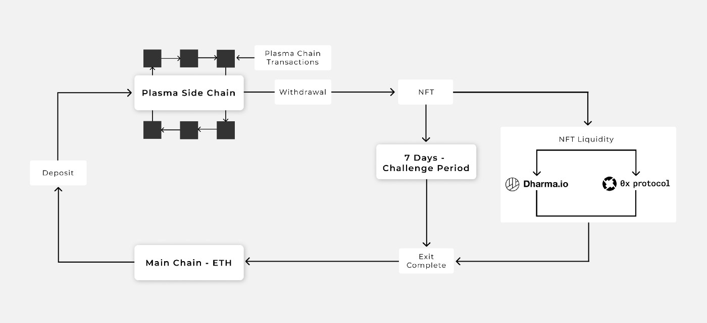

# Beginner-friendly tutorial to Matic.js

This tutorial will act as a guide for a step-by-step process to understand and use Matic JS, which is the easiest way to interact with the Matic Network. This guide is directed towards developers just starting to begin their Ethereum journey. Experienced developers can skim through the article or choose to directly go to https://docs.matic.network/getting-started/.

### Prerequisites:

### Some ETH on Kovan in your account

In order to make any transactions, you will also need some Ether in the test accounts that you will use while following the tutorial. In case you don’t have some ETH on Kovan, you can use the faucet links given here — https://faucet.metamask.io/ or https://gitter.im/kovan-testnet/faucet. 

### Matic Faucet

Throughout this tutorial, we will be using the ERC20 token `TEST` on the Kovan network as an example. In your DApp, you can replace it with any ERC20 token. To get some example `TEST` tokens on Matic Network, you can drop an email to info@matic.network.

This is only a temporary workaround till we get our Matic Faucet up and running.

## Using Matic JS

We will be showcasing the flow for asset transfers on the Matic Network in this tutorial and how you can do the same using Matic.js:

* User deposits tokens in Matic contract on mainchain
* Once deposited tokens get confirmed on the main chain, the corresponding tokens will get reflected on the Matic chain.
* The user can now transfer tokens to anyone they want instantly with negligible fees. Matic chain has faster blocks (approximately 1 second). That way, the transfer will be done almost instantly.
* Once a user is ready, they can withdraw remaining tokens from the mainchain by establishing proof of remaining tokens on Root contract (contract deployed on Kovan/Ethereum chain) within 7 days.
* User can also get a fast exit via 0x or Dharma (coming soon!)

