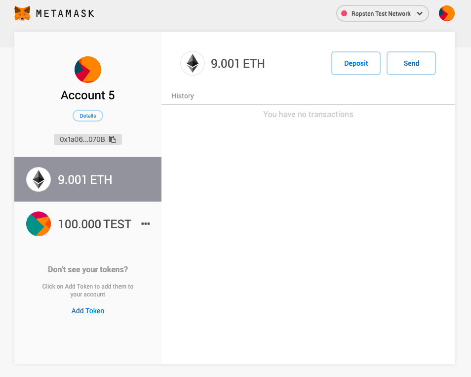

# Depositing Funds from Ropsten to Matic

Within the `matic-js-test` folder, create a new file and name it `deposit-ERC20.js`. (or `deposit-ERC721.js`) and add the following code

```js
const Network = require("@maticnetwork/meta/network")
const Matic = require("@maticnetwork/maticjs").default
const config = require('../config.json')

const network = new Network(config.network, config.version)
const MaticNetwork = network.Matic 
const MainNetwork = network.Main 

const Ropsten_Erc20Address = config.Ropsten_Erc20Address
const Matic_Erc20Address = config.Matic_Erc20Address

const Ropsten_Erc721Address = config.Ropsten_Erc721Address
const Matic_Erc721Address = config.Matic_Erc721Address

const from = config.from // from address

const matic = new Matic({
    maticProvider: MaticNetwork.RPC,
    parentProvider: MainNetwork.RPC,
    rootChain: MainNetwork.Contracts.RootChain,
    withdrawManager: MainNetwork.Contracts.WithdrawManagerProxy,
    depositManager: MainNetwork.Contracts.DepositManagerProxy,
    registry: MainNetwork.Contracts.Registry
})
```

> **Never store your private key in code on production** — this is added in the `config.js` file for illustration purposes. Typically a user’s private key will be stored in a browser wallet such as Metamask or a mobile wallet such as the Matic wallet, Status or a hardware wallet.

**Deposit is a 2 step process**

1. The tokens need to be first approved to the Matic rootchain contract on Ethereum.
2. Once approved, the deposit function is to be invoked where the tokens get deposited to the Matic contract, and are available for use in the Matic network.

Once matic object has been instantiated and wallet set up in place, add the following code, depending upon the type of token you're depositing: 


### ERC20
```js
const token = Ropsten_Erc20Address
// const amount = config.value
const amount = '1000000000000000000' // amount in wei

// Deposit is a 2 step process
// Approve token : The tokens need to be first approved to the Matic rootchain contract on Ethereum.
matic
  .approveERC20TokensForDeposit(token, amount, {
    from,
    onTransactionHash: (hash) => {
      // action on Transaction success
      console.log(hash) // eslint-disable-line
    },
  })
  .then(() => {
    // Deposit tokens : Once approved, the deposit function is to be invoked where the tokens get deposited to the Matic contract, and are available for use in the Matic network.
    matic.depositERC20Tokens(token, from, amount, {
      from,
      onTransactionHash: (hash) => {
        // action on Transaction success
        console.log(hash) // eslint-disable-line
      },
    })
  })
```
`amount` is the amount that is to be deposited. Amount is mentioned in `wei` . To those new to the field, `1 TEST` token is equivalent to 10¹⁸ `wei` . In the code snippet, `0.01 TEST` = 10¹⁶ `wei`.

### ERC721
```js
const token = Ropsten_Erc721Address
// const tokenId = config.value
const tokenId = '1' // ERC721 token Id

// Deposit is a 2 step process
// Approve token : The tokens need to be first approved to the Matic rootchain contract on Ethereum.
matic
  .approveERC721TokenForDeposit(token, tokenId, {
    from,
    onTransactionHash: (hash) => {
      // action on Transaction success
      console.log(hash) // eslint-disable-line      
    },
  })
  .then(() => {
    // Deposit tokens : Once approved, the deposit function is to be invoked where the tokens get deposited to the Matic contract, and are available for use in the Matic network.
    matic.depositERC721Tokens(token, from, tokenId, {
      from,
      onTransactionHash: (hash) => {
        // action on Transaction success
        console.log(hash) // eslint-disable-line
      },
    })
  })

```
Here, instead of `amount` we mention the `tokenId` to be deposited.

### Config.js

You will also need to create another file `config.js`. This will contain all configuration related to Matic.js.
```js
{
    "network":'testnet',
    "version": "v3",

    "privateKey": '<paste your private key here>', // A sample private key prefix with `0x`
    "from": '<paste address corresponding to the private key>',
    
    "Ropsten_Erc20Address": "",
    "Matic_Erc20Address": "",
    
    "Ropsten_Erc721Address": "",
    "Matic_Erc721Address": "",

    "value": "" 
}
```
For now, don’t worry about these values — just keep them as is.

> You will need to add your private key here. Signing of transactions will require your private key. Again, it is **NOT ADVISABLE** to hard code your private key when on production. Later, you can build keeping in mind that the user will be handling their keys at their end with MetaMask, Matic Wallet or any other compatible user wallet.

> Make sure you prefix `0x` to your private key.

## Expected Flow

For reference purposes, the screenshots below will provide context during the actual deposit.

We currently have `100 TEST` tokens and `9` ETH at our address `0x1a06816065731fcBD7296f9B2400d632816b070B` on Ropsten Network,



while on Matic Network we have `0 TEST` tokens.


We will be depositing `1 TEST` tokens to Matic Testnet.

Let’s run the Deposit function. To run use:

`$ node deposit-ERC20.js`

or `$ node deposit-ERC721.js`

We have added console logging for both events, which when run successfully will display the Transaction Hash as well as a message `“Deposit Tokens from Ropsten/Ethereum to Matic — Transaction Approved.”.` Once deposit is complete, you will see the Transaction Hash and message `”Tokens deposited from Ropsten/Ethereum to Matic.”` Since this is only for illustration purposes, the message can be customized to anything of your choice. By default it will only display the Transaction Hash.


Let’s verify our account balances on Metamask.

Our Balance on Ropsten now shows `99 TEST` which means our Deposit transaction of `1 TEST` was successful.


Verifying our balance on Matic Testnet also shows that our balance is increased by `1 TEST`.


Congratulations! You have successfully deposited funds from Ropsten to Matic.

In order to ensure you have more funds, deposit `1 TEST` token to Matic by repeating the above process. Make sure you change the `amount` value in the above script.
