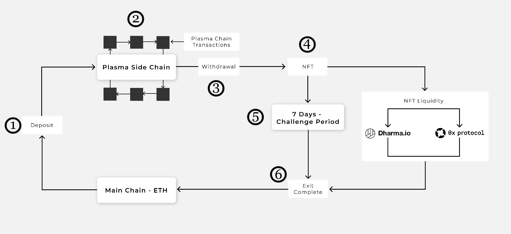
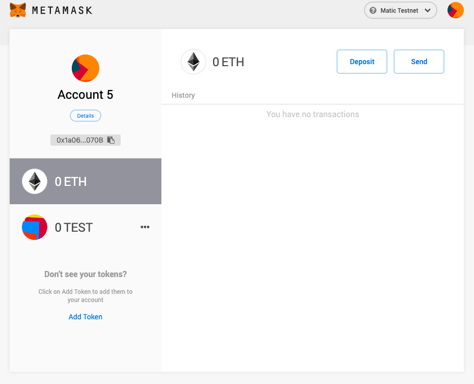
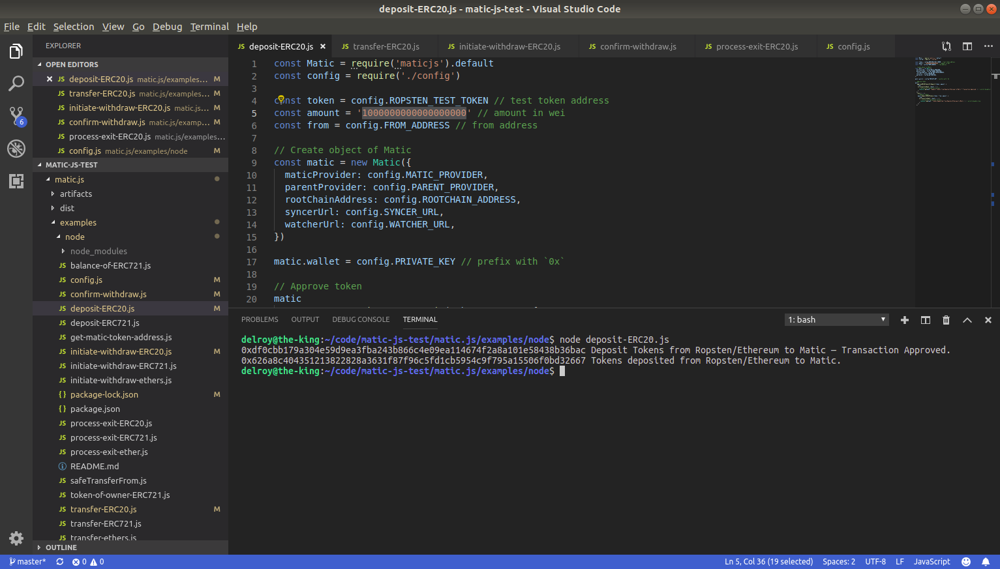
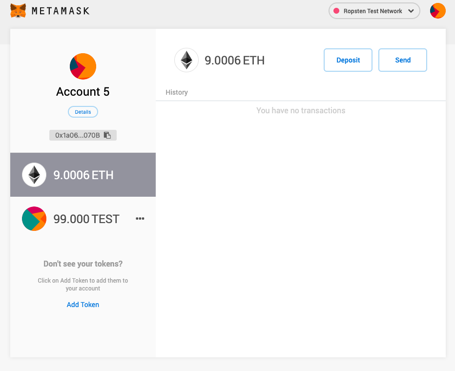
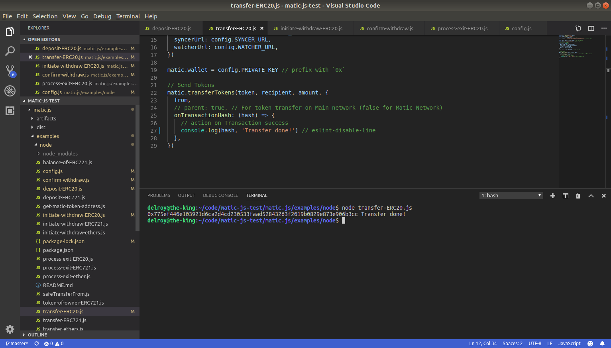
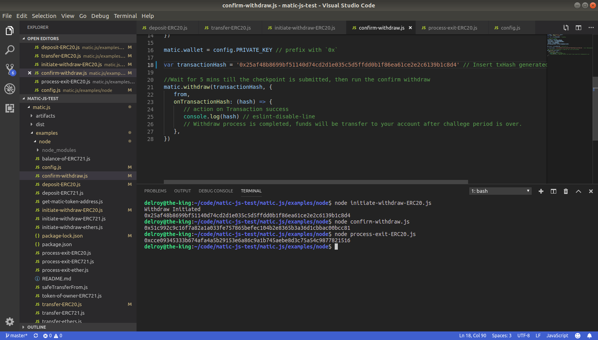

# Beginner-friendly tutorial to Matic.js

This tutorial will act as a guide for step-by-step process to understand and use [Matic JS](https://github.com/maticnetwork/matic.js), which is the easiest way to interact with the Matic Network. 

The process followed here is:

1. Deposit assets from root chain to Matic
2. Transfer assets between accounts on Matic
3. Withdraw assets from Matic on to root chain

In this tutorial we use ERC-20 assets to be transferred from Ropsten to Matic. The flow discussed below remains similar for ERC-721 assets with minor changes that will be mentioned wherever required.

### Prerequisites:

### Some ETH in your Ropsten account

In order to make any transactions, you will also need some Ether in the test accounts that you will use while following the tutorial. In case you don’t have some ETH on Ropsten, you can use the faucet links given here — https://faucet.metamask.io/ or https://faucet.ropsten.be/.

### Matic Faucet

Throughout this tutorial, we will be using the ERC20 token `TEST` on the Ropsten network as an example. This is a TEST token. In your DApp, you can replace it with any ERC20 token. To get some Test `TEST` tokens on Matic Network, you can access the Matic Faucet by clicking on the link below

<div style={{textAlign: 'center', paddingTop: '15px', paddingBottom: '15px'}}>
        <button className="btn btn-primary btn-md" style={{padding: '15px', backgroundColor: '#000', color: '#fff', borderRadius: '4px', cursor: 'pointer', boxShadow: '0px 4px 7px -4px rgba(0,0,0,0.75)'}}>
          <a href="https://faucet.matic.network/" target="_blank" style={{color: 'inherit'}}>
            Get Test Tokens
          </a>
        </button>
      </div>

## Using Matic JS

We will be showcasing the flow for asset transfers on the Matic Network in this tutorial and how you can do the same using Matic.js:



1. User deposits crypto assets in Matic contract on mainchain
2. Once deposited tokens get confirmed on the mainchain, the corresponding tokens will get reflected on the Matic chain
    - The user can now transfer tokens to anyone they want instantly with negligible fees. Matic chain has faster blocks (approximately 1 second). That way, the transfer will be done almost instantly.
3. Once a user is ready, they can withdraw remaining tokens from the mainchain. Withdrawal of funds is initiated from the Plasma Sidechain. A checkpoint interval of 5 mins is set, where all the blocks on the Matic block layer are validated since the last checkpoint.
4. Once the checkpoint is submitted to the mainchain Ethereum contract, an Exit NFT (ERC721) token is created of equivalent value.
5. Users need to wait for a 7 day challenge period
6. Once the challenge period is complete, the withdrawn funds can be claimed back to your Ethereum acccount from the mainchain contract using a process-exit procedure.
    - User can also get a fast exit via 0x or Dharma (coming soon!)

### Basic setup for the tutorial

To easily visualise the flow of funds on the Matic Network, it is instructive if you configure the Matic testnet on Metamask. Note that we are using Metamask here solely for visualization purposes. There is no requirement to use Metamask at all for using the Matic Network.

Before starting with the tutorial, go ahead and have 3 Ethereum test accounts ready. In case you are new to Ethereum and Metamask, you can refer https://docs.matic.network/newbies/create-accounts-metamask/ on instructions on how to.

For your reference we will be using the following accounts in this tutorial

```js
Account #1: 0x1a06816065731fcBD7296f9B2400d632816b070B
Account #2: 0xf66f409086647591e0c2f122C1945554b8e0e74F
Account #3: 0xbFF81BA6Fa6593F0467592ACcF770A120f740552
```

When you create multiple accounts at your end, your addresses will be different from those shown here.

In order to view the flow of funds easily on the Matic Network using Matic.js, you can configure Matic’s testnet URL on Metamask. Refer this link — https://docs.matic.network/newbies/conf-testnet-metamask/ to quickly set it up. Note this is **optional**. You can query using web3, if you choose to.

### Configuring Matic Test tokens on Metamask

The `TEST` token, taken as an example for this tutorial, can be configured in Metamask so as to easily visualise account balances. Again note this is **optional**. You can very easily query the token balances and other variables using [web3](https://web3js.readthedocs.io/en/1.0/)

These Test tokens needs to be added (depending upon the type of asset you are using - erc20/erc721) to all 3 test accounts in Metamask once each in both the Ropsten and Matic testnets:

|  |Ropsten  |Matic  |
|---|---|---|
|TEST (ERC20)  | `0x70459e550254b9d3520a56ee95b78ee4f2dbd846` | `0xc82c13004c06e4c627cf2518612a55ce7a3db699` |
|TEST (ERC721)  | `0x07d799252cf13c01f602779b4dce24f4e5b08bbd` | `0x9f289a264b6db56d69ad53f363d06326b984e637` |

In case you are new to Ethereum and Metamask, you can refer https://docs.matic.network/newbies/conf-custom-tokens-metamask/ on instructions on how to.

## Introducing Matic.js

The Matic.js repository is hosted on Github at https://github.com/maticnetwork/matic.js/

For reference purposes, I will be creating a test folder to showcase how to setup Matic.js step-by-step. Go ahead and create a folder for this tutorial — I am going with `$ mkdir matic-js-test`

Install the `maticjs` package via npm:

```js
$ npm install --save web3 maticjs
$ npm i --save @maticnetwork/meta
```

If you wish to directly refer a set of code examples, you can do so at https://github.com/maticnetwork/matic.js/tree/master/examples

### Depositing Funds from Ropsten to Matic

Within the `matic-js-test` folder, create a new file and name it `deposit-ERC20.js`. (or `deposit-ERC721.js`) and add the following code

```js
const Network = require("@maticnetwork/meta/network")
const Matic = require("@maticnetwork/maticjs").default
const config = require('../config.json')

const network = new Network(config.network, config.version)
const MaticNetwork = network.Matic 
const MainNetwork = network.Main 

const Erc20Address = config.Erc20Address
const Erc721Address = config.Erc721Address

const matic = new Matic({
    maticProvider: MaticNetwork.RPC,
    parentProvider: MainNetwork.RPC,
    rootChain: MainNetwork.Contracts.RootChain,
    withdrawManager: MainNetwork.Contracts.WithdrawManagerProxy,
    depositManager: MainNetwork.Contracts.DepositManagerProxy,
    registry: MainNetwork.Contracts.Registry
})
```

> **Never store your private key in code on production** — this is added in the `config.js` file for illustration purposes. Typically a user’s private key will be stored in a browser wallet such as Metamask or a mobile wallet such as the Matic wallet, Status or a hardware wallet.

Once matic object has been instantiated and wallet set up in place, add the following code, depending upon the type of token you're depositing: 

#### ERC20
```js
const amount = '1000000000000000000' // amount in wei

// Approve token
matic
  .approveERC20TokensForDeposit(token, amount, {
    from,
    onTransactionHash: (hash) => {
      // action on Transaction success
      console.log(hash) // eslint-disable-line
    },
  })
  .then(() => {
    // Deposit tokens
    matic.depositERC20Tokens(token, from, amount, {
      from,
      onTransactionHash: (hash) => {
        // action on Transaction success
        console.log(hash) // eslint-disable-line
      },
    })
  })
```
`amount` is the amount that is to be deposited. Amount is mentioned in `wei` . To those new to the field, `1 TEST` token is equivalent to 10¹⁸ `wei` . In the code snippet, `0.01 TEST` = 10¹⁶ `wei`.

```js

const tokenId = '1' // ERC721 token Id
matic
  .approveERC721TokenForDeposit(token, tokenId, {
    from,
    onTransactionHash: (hash) => {
      // action on Transaction success
      console.log(hash) // eslint-disable-line      
    },
  })
  .then(() => {
    matic.depositERC721Tokens(token, from, tokenId, {
      from,
      onTransactionHash: (hash) => {
        // action on Transaction success
        console.log(hash) // eslint-disable-line
      },
    })
  })

```

Here, instead of `amount` we mention the `tokenId` to be deposited.


You will also need to create another file `config.js`. This will contain all configuration related to Matic.js.
```js
{
    "network":'testnet',
    "version": "v3",

    "privateKey": '<paste your private key here>', // A sample private key prefix with `0x`
    "from": '<paste address corresponding to the private key>',

    "Erc721Address": "",
    "Erc20Address": "",
    "value": "" 
}
```
For now, don’t worry about these values — just keep them as is.

You will need to add your private key here. Signing of transactions will require your private key. Again, it is **NOT ADVISABLE** to hard code your private key when on production. Later, you can build keeping in mind that the user will be handling their keys at their end with MetaMask, Matic Wallet or any other compatible user wallet.

Make sure you prefix `0x` to your private key.

Deposit is a 2 step process

- The tokens need to be first approved to the Matic rootchain contract on Ethereum.

```js
// Approve token
matic
  .approveERC20TokensForDeposit(token, amount, {
    from,
    onTransactionHash: (hash) => {
      // action on Transaction success
      console.log(hash, 'Deposit Tokens from Ropsten/Ethereum to Matic — Transaction Approved.') // eslint-disable-line
    },
  })
```

- Once approved, the deposit function is to be invoked where the tokens get deposited to the Matic contract, and are available for use in the Matic network.

```js
 // Deposit tokens
    matic.depositERC20Tokens(token, from, amount, {
      from,
      onTransactionHash: (hash) => {
        // action on Transaction success
        console.log(hash, 'Tokens deposited from Ropsten/Ethereum to Matic.') // eslint-disable-line
      },
    })
```

For reference purposes, the screenshots below will provide context during the actual deposit.

We currently have `100 TEST` tokens and `9` ETH at our address `0x1a06816065731fcBD7296f9B2400d632816b070B` on Ropsten Network,


while on Matic Network we have `0 TEST` tokens.



We will be depositing `1 TEST` tokens to Matic Testnet.

Let’s run the Deposit function. To run use:

`$ node deposit-ERC20.js`

or `$ node deposit-ERC721.js`

We have added console logging for both events, which when run successfully will display the Transaction Hash as well as a message `“Deposit Tokens from Ropsten/Ethereum to Matic — Transaction Approved.”.` Once deposit is complete, you will see the Transaction Hash and message `”Tokens deposited from Ropsten/Ethereum to Matic.”` Since this is only for illustration purposes, the message can be customized to anything of your choice. By default it will only display the Transaction Hash.



Let’s verify our account balances on Metamask.

Our Balance on Ropsten now shows `99 TEST` which means our Deposit transaction of `1 TEST` was successful.



Verifying our balance on Matic Testnet also shows that our balance is increased by `1 TEST`.


Congratulations! You have successfully deposited funds from Ropsten to Matic.

In order to ensure you have more funds, deposit `1 TEST` token to Matic by repeating the above process. Make sure you change the `amount` value in the above script.

### Transferring funds from Matic

Once you have funds on Matic, you can use those funds to send to others instantly.

Create a new file — `transfer-ERC20.js` —  in your code directory. (or `transfer-ERC721.js`)

```js
const Network = require("@maticnetwork/meta/network")
const Matic = require("@maticnetwork/maticjs").default
const config = require('../config.json')

const network = new Network(config.network, config.version)
const MaticNetwork = network.Matic 
const MainNetwork = network.Main 

const Erc20Address = config.Erc20Address
const Erc721Address = config.Erc721Address


const from = config.FROM_ADDRESS // from address
const recipient = 'Paste Your receipent address here ...' // receipent address


const matic = new Matic({
    maticProvider: MaticNetwork.RPC,
    parentProvider: MainNetwork.RPC,
    rootChain: MainNetwork.Contracts.RootChain,
    withdrawManager: MainNetwork.Contracts.WithdrawManagerProxy,
    depositManager: MainNetwork.Contracts.DepositManagerProxy,
    registry: MainNetwork.Contracts.Registry
})
```
`recipient` is the receiver’s address, to whom the funds are supposed to be sent.

```js
const recipient = "0xf66f409086647591e0c2f122C1945554b8e0e74F" // to address
```

Once the above setup is in place, now depending upon the asset you are transferring, add the following code:

#### ERC20
```js
const amount = '1000000000000000000' // amount in wei

// Send Tokens
matic.transferTokens(token, recipient, amount, {
  from,
  // parent: true, // For token transfer on Main network (false for Matic Network)
  onTransactionHash: (hash) => {
    // action on Transaction success
    console.log(hash) // eslint-disable-line
  },
})
```

#### ERC721
```js
const tokenId = '1' // ERC721 token Id
// Send Tokens
matic.transferERC721Tokens(token, receipent, tokenId, {
  from,
  // parent: true, // For token transfer on Main network (false for Matic Network)
  onTransactionHash: (hash) => {
    // action on Transaction success
    console.log(hash) // eslint-disable-line
  },
})
```

The config details are then mentioned appropriately. You need not make any changes to it.

**Sidenote** — you can change the `parent` parameter to TRUE if you are using Matic.js to transfer funds on the main Ethereum network.

We have added console logging on both events, which when run successfully will display `“Transfer done!”` to assure that the transaction was completed successfully. These messages are completely customized for this tutorial, by default only the Transaction Hash will be displayed.

We will be making 2 different transfers worth `1 TEST` and `0.100 TEST` tokens respectively.

The screenshots below will provide context during the actual transfer.

**Transfer #1**

We will be transferring `1 TEST` from Account 1 to Account 2 on Matic Network.

Account 1–`0x1a06816065731fcBD7296f9B2400d632816b070B`. This account currently holds `11 TEST` tokens.

Account 2–`0xf66f409086647591e0c2f122C1945554b8e0e74F`. This account currently holds `0 TEST` tokens.


Now we will run the transfer function. Run this on the terminal:

`$ node transfer-ERC20.js`



Once the code has run successfully, it will display a message of `"Transfer done!"`

Let’s verify our balances on Metamask.

Our balance on account address — `0x1a06816065731fcBD7296f9B2400d632816b070B` is now updated to `10 TEST` tokens.


And to confirm that on our receiver’s account, our balance is now updated to `1 TEST` tokens.


You can also check the transaction on the Matic Explorer by searching the transaction hash.

Link to the explorer - https://explorer.testnet2.matic.network/


**Transfer #2**

In this transaction we will attempt to transfer `0.100 TEST` from Account 1 to Account 3.

From — `0x1a06816065731fcBD7296f9B2400d632816b070B`

To — `0xbFF81BA6Fa6593F0467592ACcF770A120f740552`. Account 3 currently has `0 TEST` tokens.


We will again run `$ node transfer-ERC20.js` from the terminal. Once we get the `‘Transfer done!’` message, we will check our balances.


Balance on Account 1 now shows a balance of `9.900TEST`,


whereas the balance on Account 3 shows us `0.100 TEST`.


### Withdraw funds from Matic

Funds that are available on Matic chain can be withdrawn back to the Ethereum Network.

In Matic, withdrawing is a 3 step process where:

1. Withdrawal of funds is initiated from Matic Network. A checkpoint interval of 5 mins is set, where all the blocks on the Matic block layer are validated since the last checkpoint.
2. Once the checkpoint is submitted to the mainchain Ethereum contract, an NFT Exit (ERC721) token is created of equivalent value. Users need to wait for a 7 day challenge period
3. Once the challenge period is complete, the withdrawn funds can be claimed back to your Ethereum acccount from the mainchain contract using a process-exit procedure.

For now, just go with the fact that the challenge period for withdrawals is an important part of the Plasma framework to ensure security of your transactions. Later, once you get to know the system better, the reason for the 7-day withdrawal window will become clear to you.

Just for reference, there will be an active exit market, which will allow trading of exit tokens (ERC721), thereby leading to faster withdrawals — but that is an article for another day.

**To keep the withdrawal process easier for now on the Matic Testnet, we have not enforced the 7-day withdrawal process**. This means while going through this tutorial and developing apps on the testnet, for now, you will get the withdrawn funds immediately after you initiate the `process-exit` procedure.

Create 3 new files and name them `initiate-withdraw-ERC20.js`, `confirm-withdraw-ERC20.js`,  and `process-exit-ERC20.js`
(Or, replace ERC20 with ERC721 in case you're using NFTs)

### Initiate Withdraw


```js
const Network = require("@maticnetwork/meta/network")
const Matic = require("@maticnetwork/maticjs").default
const config = require('../config.json')

const network = new Network(config.network, config.version)
const MaticNetwork = network.Matic 
const MainNetwork = network.Main 

const Erc20Address = config.Erc20Address
const Erc721Address = config.Erc721Address


const matic = new Matic({
    maticProvider: MaticNetwork.RPC,
    parentProvider: MainNetwork.RPC,
    rootChain: MainNetwork.Contracts.RootChain,
    withdrawManager: MainNetwork.Contracts.WithdrawManagerProxy,
    depositManager: MainNetwork.Contracts.DepositManagerProxy,
    registry: MainNetwork.Contracts.Registry
})
```
The above setup code remains the same for ERC20/ERC721

Now, depending upon your asset, add the following code:

#### ERC20

```js
const amount = '1000000000000000000' // amount in wei
// NOTE: Initiate the withdraw on the Matic chain, and wait for ~5 minutes for 
// the checkpoint (refer https://whitepaper.matic.network/#checklayer for technical details) 
// before confirming the withdraw by executing `confirm-withdraw.js`.
// The txHash from the output needs to be copied to the `confirm-withdraw.js` file before executing
matic
 .startWithdraw(token, amount, {
   from,
   onTransactionHash: (hash) => {
    //  console.log("Withdraw Initiated")
    console.log(hash) // eslint-disable-line
   },
})
```

#### ERC721

```js
const tokenId = '1' // ERC721 token Id
matic
  .startERC721Withdraw(token, tokenId, {
    from,
    onTransactionHash: (hash) => {
      // action on Transaction success
      console.log(hash) // eslint-disable-line
    },
  })

// NOTE: Wait for next checkpoint, which will take approximately 5-10 mins. 
// Then you can call complete-withdraw.js to submit proof.
```

### Confirm Withdraw

The code for confirm withdraw remains common for ERC20 AND ERC721 tokens

```js
const Network = require("@maticnetwork/meta/network")
const Matic = require("@maticnetwork/maticjs").default
const config = require('../config.json')

const network = new Network(config.network, config.version)
const MaticNetwork = network.Matic 
const MainNetwork = network.Main 

const Erc20Address = config.Erc20Address
const Erc721Address = config.Erc721Address


const matic = new Matic({
    maticProvider: MaticNetwork.RPC,
    parentProvider: MainNetwork.RPC,
    rootChain: MainNetwork.Contracts.RootChain,
    withdrawManager: MainNetwork.Contracts.WithdrawManagerProxy,
    depositManager: MainNetwork.Contracts.DepositManagerProxy,
    registry: MainNetwork.Contracts.Registry

var transactionHash = 'Paste txHash here ...' // Insert txHash generated from initiate-withdraw.js 

//Wait for 5 mins till the checkpoint is submitted, then run the confirm withdraw
matic.withdraw(transactionHash, {
   from,
   onTransactionHash: (hash) => {
      // action on Transaction success
      console.log(hash) // eslint-disable-line
      // Withdraw process is completed, funds will be transfer to your account after challege period is over.
   },
})
```

### Process Exit

The code for confirm withdraw remains common for ERC20 AND ERC721 tokens except for the value of `Erc721Address`

```js

const Network = require("@maticnetwork/meta/network")
const Matic = require("@maticnetwork/maticjs").default
const config = require('../config.json')

const network = new Network(config.network, config.version)
const MaticNetwork = network.Matic 
const MainNetwork = network.Main 

const Erc20Address = config.Erc20Address
const Erc721Address = config.Erc721Address


const matic = new Matic({
    maticProvider: MaticNetwork.RPC,
    parentProvider: MainNetwork.RPC,
    rootChain: MainNetwork.Contracts.RootChain,
    withdrawManager: MainNetwork.Contracts.WithdrawManagerProxy,
    depositManager: MainNetwork.Contracts.DepositManagerProxy,
    registry: MainNetwork.Contracts.Registry

// NOTE: Wait for NFT Challenge period to be complete
matic.processExits(Erc721Address, {
   from,
   onTransactionHash: (hash) => {
      // action on Transaction success
      // DEVNOTE: on sucessfull processExits funds will be transfered to your mainchain account
      console.log(hash) // eslint-disable-line
   },
})
```

_Note: A checkpoint, which is a representation of all transactions happening on the Matic Network to the Ethereum chain every ~5 minutes, is submitted to the mainchain Ethereum contract._

### Withdrawing funds from Matic to Ethereum

We will now initiate the Withdraw process.

We currently have `9.900 TEST` tokens at our address on Matic — `0x1a06816065731fcBD7296f9B2400d632816b070B`

We will withdraw `1 TEST` from the Matic Account.

To initiate the withdraw we will run `$ node initiate-withdraw-ERC20.js`.

Once this process is initiated, you will receive the transaction hash. The transaction hash will be used as input to run the next step i.e. confirm withdraw process.

I’ll add the transaction hash to the code — `0x1b12ae634c7538adfcbddd5028ea47aa97fd8d07c0e3aeffd0caa2fff80cc365`. Note that in your case, this transaction hash will be different.

Once the initiate process is complete, we will wait for ~5 minutes, before running the second script `$ node confirm-withdraw.js`.


To verify, we will also check the account balances on Metamask.

The balance on Account 1 on Matic Network now shows `8.900 TEST` Tokens.


Now, in order to claim your funds after the challenge period is complete, you will need to run the `process-exit-ERC20.js`

So let's run `$ process-exit-ERC20.js`



Once this is complete, you will see the funds in your Ropsten account.

So that’s it folks! You have withdrawn your funds successfuly and gotten to the end of this tutorial :)

Hope you have understood now that interacting with the Matic Network is quite easy. We will dive deeper and explore advanced interactions with Matic in later posts.

Similarly, as an exercise you can Deposit, transfer and withdraw ERC721 and Ether using Matic.js following the same steps as above.

Feel free to reach out to us at https://stack.matic.network/ in case you face any issues.
