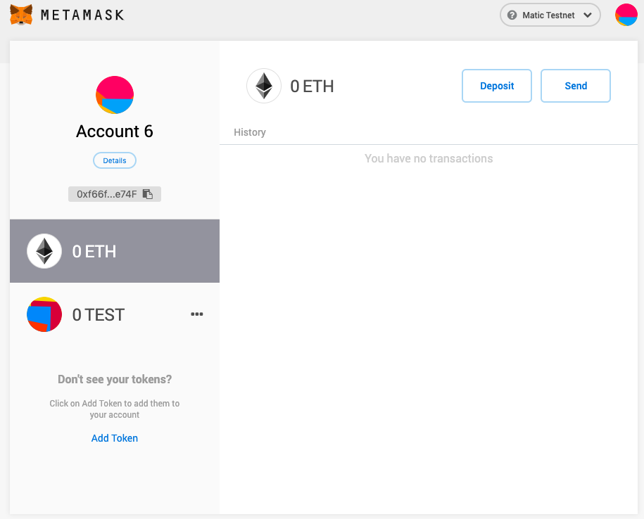
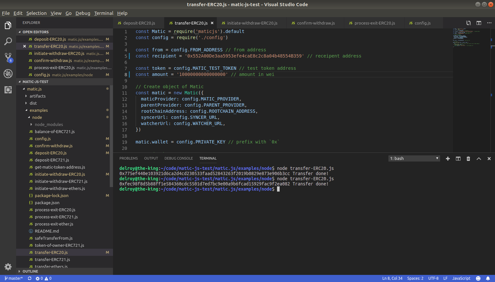

# Transferring funds within Matic

Once you have funds on Matic, you can use those funds to send to others instantly.

Create a new file — `transfer-ERC20.js` —  in your code directory. (or `transfer-ERC721.js`)
```js
const Network = require("@maticnetwork/meta/network")
const Matic = require("@maticnetwork/maticjs").default
const config = require('../config.json')

const network = new Network(config.network, config.version)
const MaticNetwork = network.Matic 
const MainNetwork = network.Main 

const Ropsten_Erc20Address = config.Ropsten_Erc20Address
const Matic_Erc20Address = config.Matic_Erc20Address

const Ropsten_Erc721Address = config.Ropsten_Erc721Address
const Matic_Erc721Address = config.Matic_Erc721Address

const from = config.from // from address

const recipient = 'Paste Your receipent address here ...' // receipent address

const matic = new Matic({
    maticProvider: MaticNetwork.RPC,
    parentProvider: MainNetwork.RPC,
    rootChain: MainNetwork.Contracts.RootChain,
    withdrawManager: MainNetwork.Contracts.WithdrawManagerProxy,
    depositManager: MainNetwork.Contracts.DepositManagerProxy,
    registry: MainNetwork.Contracts.Registry
})
```

`recipient` is the receiver’s address, to whom the funds are supposed to be sent.

```js
const recipient = "0xf66f409086647591e0c2f122C1945554b8e0e74F" // to address
```

Once the above setup is in place, now depending upon the asset you are transferring, add the following code:

### ERC20
```js
const token = Matic_Erc20Address
// const amount = config.value
const amount = '1000000000000000000' // amount in wei

// Send Tokens
matic.transferTokens(token, recipient, amount, {
  from,
  // parent: true, // For token transfer on Main network (false for Matic Network)
  onTransactionHash: (hash) => {
    // action on Transaction success
    console.log(hash) // eslint-disable-line
  },
})
```

### ERC721
```js
const token = Matic_Erc721Address
// const tokenId = config.value
const tokenId = '1' // ERC721 token Id

// Send Tokens
matic.transferERC721Tokens(token, receipent, tokenId, {
  from,
  // parent: true, // For token transfer on Main network (false for Matic Network)
  onTransactionHash: (hash) => {
    // action on Transaction success
    console.log(hash) // eslint-disable-line
  },
})
```

The config details are then mentioned appropriately. You need not make any changes to it.

> **Sidenote** — you can change the `parent` parameter to TRUE if you are using Matic.js to transfer funds on the main Ethereum network.

We have added console logging on both events, which when run successfully will display `“Transfer done!”` to assure that the transaction was completed successfully. These messages are completely customized for this tutorial, by default only the Transaction Hash will be displayed.

### Config.js

You will also need to create another file `config.js`. This will contain all configuration related to Matic.js.
```js
{
    "network":'testnet',
    "version": "v3",

    "privateKey": '<paste your private key here>', // A sample private key prefix with `0x`
    "from": '<paste address corresponding to the private key>',
    
    "Ropsten_Erc20Address": "",
    "Matic_Erc20Address": "",
    
    "Ropsten_Erc721Address": "",
    "Matic_Erc721Address": "",

    "value": "" 
}
```
For now, don’t worry about these values — just keep them as is.

> You will need to add your private key here. Signing of transactions will require your private key. Again, it is **NOT ADVISABLE** to hard code your private key when on production. Later, you can build keeping in mind that the user will be handling their keys at their end with MetaMask, Matic Wallet or any other compatible user wallet.

> Make sure you prefix `0x` to your private key.

## Expected Flow

We will be making 2 different transfers worth `1 TEST` and `0.100 TEST` tokens respectively.

The screenshots below will provide context during the actual transfer.

### **Transfer #1**

We will be transferring `1 TEST` from Account 1 to Account 2 on Matic Network.

Account 1–`0x1a06816065731fcBD7296f9B2400d632816b070B`. This account currently holds `11 TEST` tokens.

Account 2–`0xf66f409086647591e0c2f122C1945554b8e0e74F`. This account currently holds `0 TEST` tokens.



Now we will run the transfer function. Run this on the terminal:

`$ node transfer-ERC20.js`


Once the code has run successfully, it will display a message of `"Transfer done!"`

Let’s verify our balances on Metamask.

Our balance on account address — `0x1a06816065731fcBD7296f9B2400d632816b070B` is now updated to `10 TEST` tokens.


And to confirm that on our receiver’s account, our balance is now updated to `1 TEST` tokens.


You can also check the transaction on the Matic Explorer by searching the transaction hash.

Link to the explorer - https://explorer.testnet2.matic.network/


### **Transfer #2**

In this transaction we will attempt to transfer `0.100 TEST` from Account 1 to Account 3.

From — `0x1a06816065731fcBD7296f9B2400d632816b070B`

To — `0xbFF81BA6Fa6593F0467592ACcF770A120f740552`. Account 3 currently has `0 TEST` tokens.


We will again run `$ node transfer-ERC20.js` from the terminal. Once we get the `‘Transfer done!’` message, we will check our balances.



Balance on Account 1 now shows a balance of `9.900TEST`,


whereas the balance on Account 3 shows us `0.100 TEST`.

