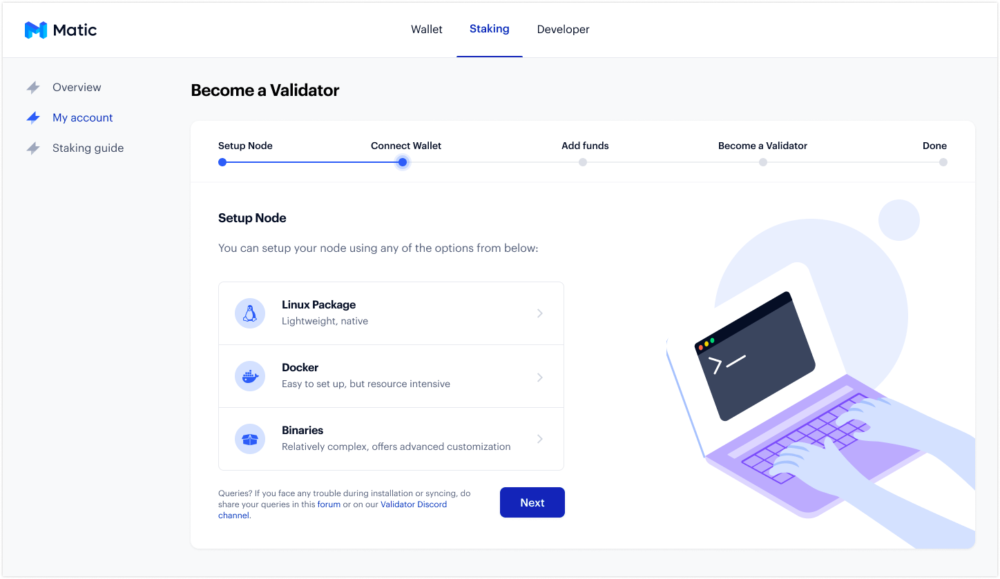
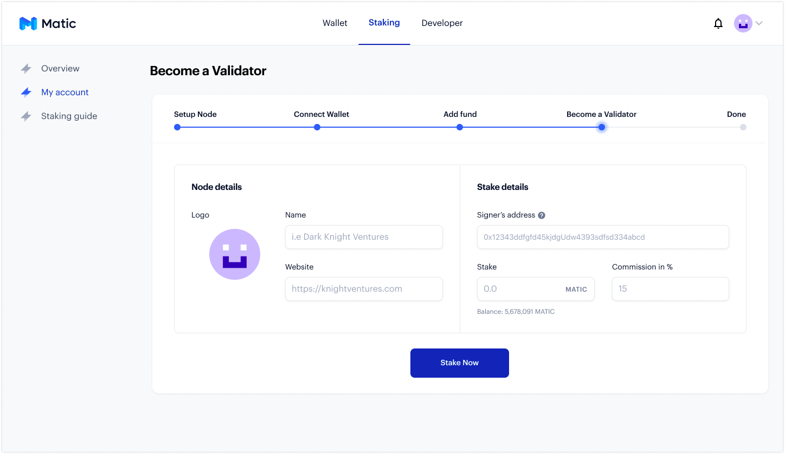

# How to Stake and Become a Validator on Matic (Stage 1 Counter Stake)

This is a step-by-step guide to help you become a validator on Matic's incentivised testnet program. The following list of commands will help you setup your heimdall and bor nodes for staking and performing validator duties.

## Pre-requisites:

You should have Heimdall and Bor setups up and running on your machine. If you haven't yet set it up, you can do so by reading this guide: [https://docs.matic.network/staking/participate-in-counter-stake/](https://docs.matic.network/staking/participate-in-counter-stake/)

**TL;DR** - We have made a short video demonstrating the staking process to become a validator. This video takes you through all the steps on how to stake and join the validator list successfully. 

    <iframe width="700" height="480" src="https://matic-public.s3.amazonaws.com/CS-2001/how-to-stake.mp4">
    </iframe>

### Account information

First you do a basic check on your account information by running the below command:

    heimdalld show-account

The following output should appear:

    {
        "address": "0x6c468CF8c9879006E22EC4029696E005C2319C9D",
        "pub_key": "0x04b12d8b2f6e3d45a7ace12c4b2158f79b95e4c28ebe5ad54c439be9431d7fc9dc1164210bf6a5c3b8523528b931e772c86a307e8cff4b725e6b4a77d21417bf19"
    }

This will display your address and public key for your validator node. **Note that this address must match with your signer address on Ethereum.**

### Show private key

Then you to do another check for your private-key by running the following command. Note that this is an **optional** step and need not be a mandatory step:

    heimdalld show-privatekey

The following output should appear:

    {
        "priv_key": "0x********************************************************"
    }

Now that you have done a basic health check and generated the keystore and private key for Bor and Heimdall respectively, you can now proceed to staking your tokens on Matic and become a validator.

## Stake on Ethereum chain

You can stake on Matic 2 different ways, Using the Validator Dashboard or by CLI

**Stake using validator dashboard**

In order to stake using the Validator Dashboard, you can use the following link to access the dashboard: https://wallet.matic.today/staking

You will be able to login using Metamask or any WalletConnect enabled wallet. We recommend using Metamask.

You have to make sure that you login using the same address where your tokens are present.

Once you login you will see the landing page and an option to become a Validator.

Clicking on **Become a validator** will navigate you to a separate page to initiate the process.

You will first be asked to setup your node. If you haven't already setup your node by now, you will need to do so, else if you proceed ahead you will receive an error when you attempt to stake.

Clicking on Next will proceed you to next step where you add Validator details and staking amount. If you are instead taken to the **Connect Wallet** or **Add Fund** screens, this means that you are either not connected to your wallet or you have not connected to the account that contains the staking tokens.

Once you enter all the required details such as Signer Address and Stake amount, you can then click on **Stake Now**.

Once the transaction is completed you will have staked successfully to become a validator. You will be asked thrice to confirm the transaction. 

* Approve Transaction - This will approve your stake transaction.
* Stake - This will confirm your stake transaction.
* Save -  This will save your validator details.

**Stake using CLI**

**Approve**

The `approve` command will initiate your transaction towards staking on Matic.

`approve` Matic tokens to `StakeManager` Stake amount and fee amount must be in 18 decimals — `1000000000000000000` is 1 Matic token. Note that stake and fee amount must be greater than 10 Matic tokens. You can keep the fee amount at 20 tokens.

    heimdallcli approve --staked-amount <stake-amount>  --fee-amount <heimdall-fee-amount>

**For example**, to approve for stake amount 100 Matic tokens and fee 20 tokens, 
    
    heimdallcli approve --staked-amount 100000000000000000000 --fee-amount 20000000000000000000 

Once you run the approve command you should see the following response along with the transaction hash.

    Sent approve tx sucessfully txHash=0x987aa9a319de34f61b768e4bbac160212055d8e5e9b813b2fc520dc650488943

To check the status of the transaction, you paste the `txHash` on this link: [https://ropsten.etherscan.io/](https://ropsten.etherscan.io/)

Once `approve` transaction gets confirmed, send `stake` transaction on Ethereum.

`--validator` is owner address of validator node. Your owner address is the same address as your wallet address from which you initiated your staking transaction.

Owner can manage stake, rewards and manage signer address for the validator. Signer address will be same as your address on node. You can always change your signer address.

    heimdallcli stake --staked-amount <stake-amount>  --fee-amount <heimdall-fee-amount> --validator <validator-owner-address>

**For example**, to stake amount 100 Matic tokens and fee 20 tokens, 
    
    heimdallcli stake --staked-amount 100000000000000000000 --fee-amount 20000000000000000000 --validator 0xc40e52501d9969B6788C173C1cA6b23DE6f33943

You should see the following response once you run the above command

    Submitted stake sucessfully txHash=0x987aa9a319de34f61b768e4bbac160212055d8e5e9b813b2fc520dc650488943

To check the status of the transaction, you paste the `txHash` on this link: [https://ropsten.etherscan.io/](https://ropsten.etherscan.io/)

### Balance

To check the balance of your address:

You can find details regarding chain id over here: https://github.com/maticnetwork/public-testnets/blob/master/CS-2002/heimdall/config/genesis.json#L3

    heimdallcli query auth account <signer-address> --chain-id <chain-id>

The following output should appear:

    address: 0x6c468cf8c9879006e22ec4029696e005c2319c9d
      coins:
      - denom: matic
        amount:
          i: "1000000000000000000000"
      accountnumber: 0
      sequence: 0

Please note that you need to keep checking if you balance has been updated with tokens or not. If you initiate Validator Join before without any tokens, you will error out. 

### Validator join

Once you have adequate balance to pay fees on Heimdall, you can join the network by running the following command:

    heimdallcli tx staking validator-join --signer-pubkey <signer-pub-key> --tx-hash <stake-ethereum-tx-hash> --chain-id <chain-id>

You can view your `pub-key` by running the command `heimdalld show-account` 

The chain-id required here is the heimdall chain-id - `heimdall-cs2002`

### Validator information

**By signer address**

    heimdallcli query staking validator-info --validator=0x6c468cf8c9879006e22ec4029696e005c2319c9d --chain-id <chain-id>

This command should display the following output:

    {
    	"ID":1,
    	"startEpoch":0,
    	"endEpoch":0,
    	"power":10,
    	"pubKey":"0x04b12d8b2f6e3d45a7ace12c4b2158f79b95e4c28ebe5ad54c439be9431d7fc9dc1164210bf6a5c3b8523528b931e772c86a307e8cff4b725e6b4a77d21417bf19",
    	"signer":"0x6c468cf8c9879006e22ec4029696e005c2319c9d",
    	"last_updated":0,
    	"accum":0
    }

**By validator id**

    heimdallcli query staking validator-info --id=1 --chain-id=<chain-id>

This command will print output in format as "validator by signer address" command.
