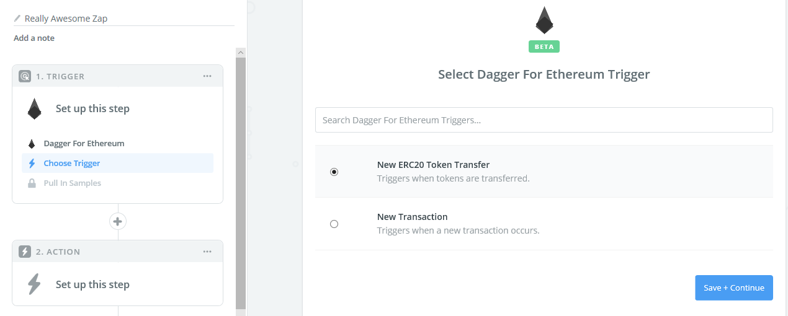
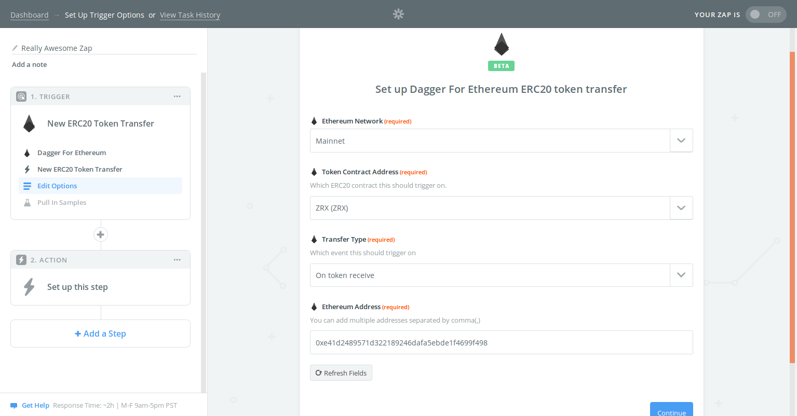
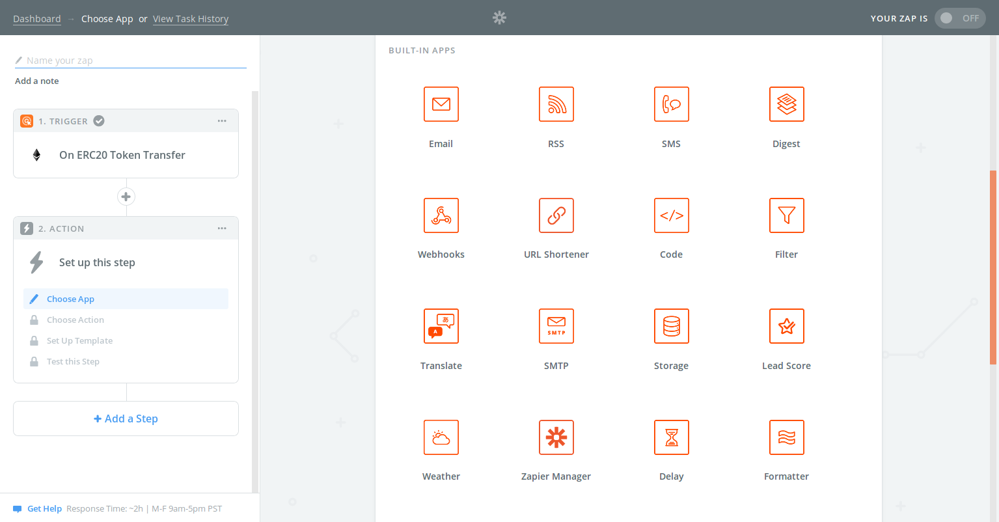
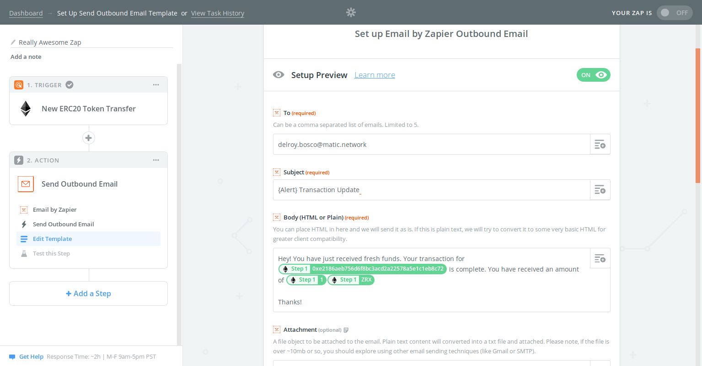
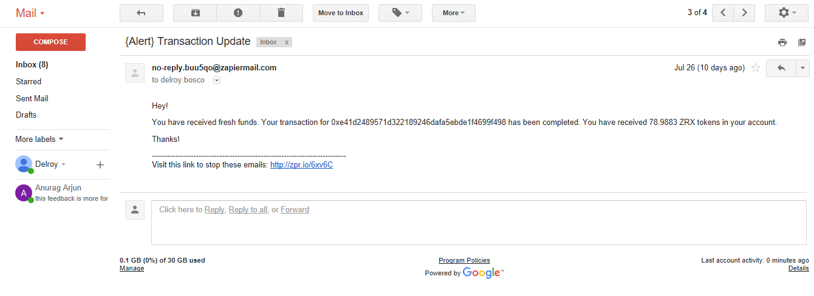
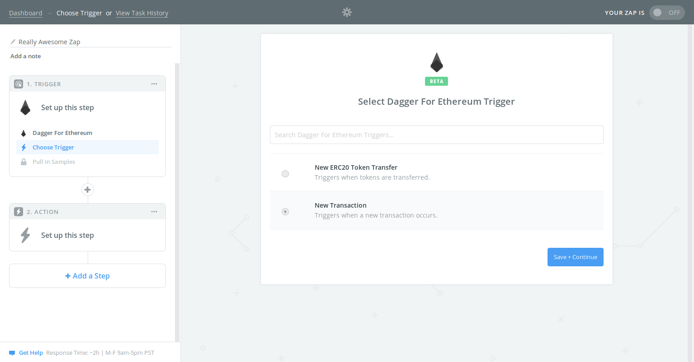
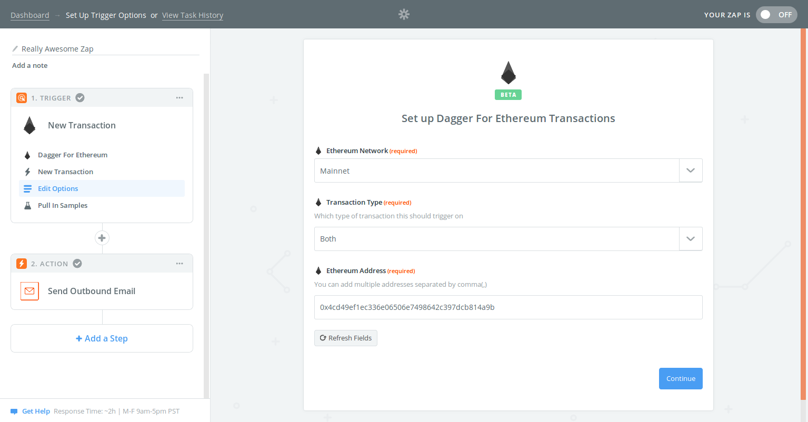
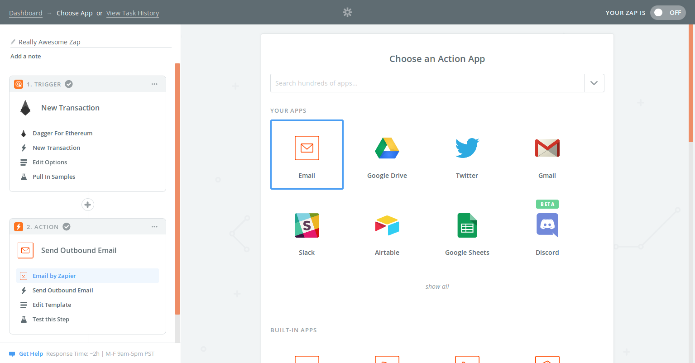
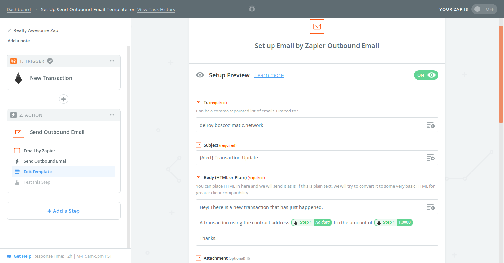
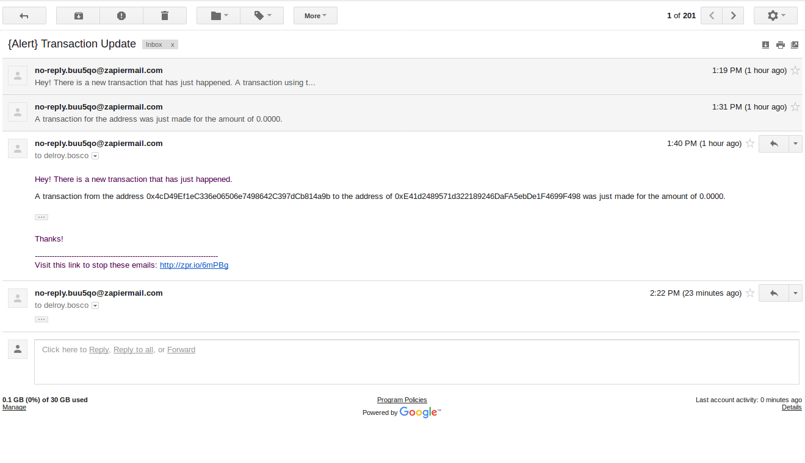

### Setting Up Dagger for Ethereum with Zapier

## Trigger Event - Setting Up a New ERC20 Token Transfer Trigger with Zapier

### Step 1: Logging in to your Zapier account

Login to your Zapier Account and click on “Make a Zap” 

### Step 2: Choosing your Trigger

Choose Dagger For Ethereum from the App drop-down menu. Zapier will navigate you to a different page with a list of triggers. These triggers are pre-defined. We will keep adding to this list as we go forward. Feel free to send us your custom requests.

### Step 3: Adding conditions to your Trigger

After choosing the trigger event, you get navigated to a different page. This page will display the trigger event details. We have chosen the trigger as “On ERC20 Token Transfer”. This means when the trade is complete i.e. The address mentioned gets ZRX tokens, you will get a notification. 

In the Ethereum Network dropdown, you get to choose between Mainnet and Kovan. You can select any contract address from the list. Now, the ‘when’ drop-down basically answers the question as to which event you would like to be notified.

For your reference the list is as such: 

In the Ethereum Network dropdown, you get to choose between Mainnet and Kovan. You can select any contract address from the list. Now, the ‘when’ drop-down basically answers the question as to which event you would like to be notified. 

### Step 4: Setting up your Zapier Integrated App

Once this process is complete, Zapier provides a confirmation of the trigger points and details of the Zap.

Click on "Fetch & Continue" to start the process. This will start fetching information about the transactions related to the contract and the ETH address added to the trigger section. Once these are confirmed an active connection is made. If anything is invalid, it will give you a prompt error.

The next section then allows choosing a method of notification. Zapier has a host of apps already built-in to set up your notification. You can even choose from external apps such as Google Sheets as a form for notifying you. 

If you choose the Email integration, you get to a page where it allows to set up an email template. Zapier has this workflow in-built.

You can choose a Sender's email address and also add a subject line. You can also adjust the body of the email according to the variables available.

You can draft the body of the email in such a way that is human readable. Using these variables will help pluck out specific information and append it. 

After all the parameters have been set up you can confirm all the options. You can even send a test email to check if the entire set up is working correctly.

Note: You can add multiple notifications mode to this segment by clicking on "Add a step".

Once the Zap is active, all you need to do is wait for the notifications to pour in, like these:

You start getting notifications particular to the address that you've chosen while setting up your Zap.  

 

## **Trigger Event - Setting Up a New Transaction Trigger with Zapier**

### Step 1: Logging in to your Zapier account

Login to your Zapier Account and click on “Make a Zap” 

### Step 2: Choosing your Trigger

Choose Dagger For Ethereum from the App drop-down menu. Zapier will navigate you to a different page with a list of triggers. These triggers are pre-defined. We will keep adding to this list as we go forward. 

### Step 3: Adding conditions to your Trigger

After choosing the trigger event, you get navigated to a different page. This page will display the trigger event details. Choose the trigger as “On New Transaction”. This means when the transaction is complete, i.e. Any new transaction has occurred, you will be getting a notification. 

In the Ethereum Network dropdown, you get to choose between Mainnet and Kovan. Now, the ‘when’ drop-down basically answers the question as to which event you would like to be notified. 

For your reference the list is as such: 

We have selected 'Both' as the trigger event. You can select any of the options from the drop down menu. So this means that you will be notified whenever there is a transaction is completed, i.e. whenever a transaction occurs on the address that we’ve specified. You then add the address for which you specifically want to be notified for. You can also add multiple addresses to this list. 

### Step 4: Settin up your Zapier Integrated App

Once this process is complete, Zapier provides a confirmation of the trigger points and details of the Zap.

Click on "Fetch & Continue" to start the process. This will start fetching information about the transactions related to the ETH address added to the trigger section. Once these are confirmed an active connection is made. If anything is invalid, it will give you a prompt error.

The next section then allows choosing a method of notification. Zapier has a host of apps already built-in to set up your notification. You can even choose from external apps such as Google Sheets as a form for notifying you. 

If you choose the Email integration, you get to a page where it allows to set up an email template. Zapier has this workflow in-built.

You can choose a Sender's email address and also add a subject line. You can also adjust the body of the email according to the variables available.

You can draft the body of the email in such a way that is human readable. Using these variables will help pluck out specific information and append it. 

After all the parameters have been set up you can confirm all the options. You can even send a test email to check if the entire set up is working correctly.

*Note: You can add multiple notifications mode to this segment by clicking on "Add a step".*

Now, you are ready to activate your Zap and test it in real-time conditions.

Once the Zap is active, all you need to do is wait for the notifications to pour in, like these:

You will start getting notifications particular to the address that you've chosen while setting up your Zap. 
